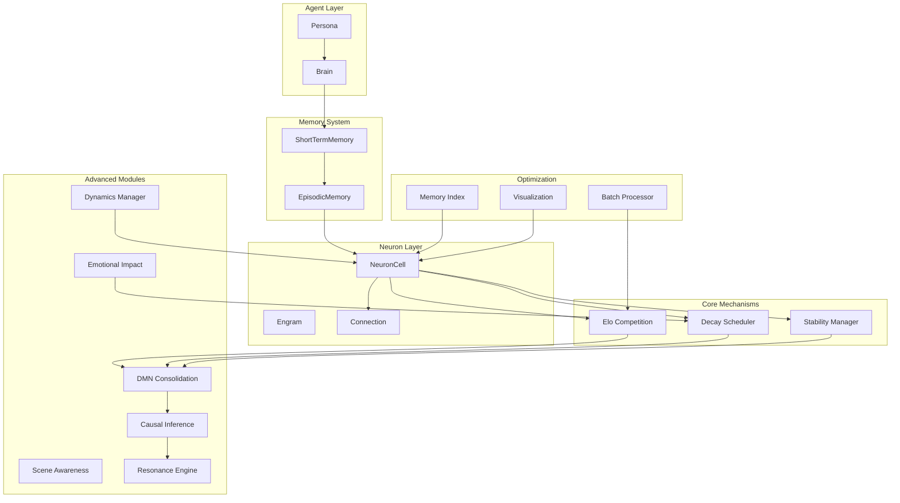

# Engram 记忆系统

**版本**: 1.0.0  
**更新时间**: 2026-04-14

Engram 是一个受神经科学启发的 AI 伴侣记忆系统，模拟人类记忆的形成、巩固、检索和遗忘机制。

---

## 核心概念

### 神经科学基础

| 概念 | 说明 |
|------|------|
| **神经元 (NeuronCell)** | 记忆的基本单元，类似生物神经元的激活-抑制机制 |
| **记忆痕迹 (Engram)** | 一组神经元的集合，代表完整的记忆片段 |
| **Hebbian 学习** | "一起激活的神经元，连接在一起" |
| **动态衰减** | 低价值记忆逐渐遗忘，高冲击记忆长期保留 |
| **Elo 竞争** | 神经元通过竞争获取激活资源 |

### 五大记忆模块

```
┌─────────────────────────────────────────────────────────────┐
│                      Memory System                          │
├─────────────────────────────────────────────────────────────┤
│  ShortTermMemory  │  EpisodicMemory  │  WorkingMemory      │
│  (海马体)         │  (新皮层)         │  (前额叶)            │
├─────────────────────────────────────────────────────────────┤
│                     NeuronCell Layer                         │
│  Elo Competition  │  Decay Scheduler  │  Stability Manager  │
├─────────────────────────────────────────────────────────────┤
│                    Supporting Modules                        │
│  DMN Consolidation  │  Causal Inference  │  Scene Awareness  │
│  Resonance Engine   │  Emotional Impact  │  Dynamics         │
└─────────────────────────────────────────────────────────────┘
```

---

## 快速开始

### 安装

```bash
pip install -r requirements.txt
```

### 基本使用

```python
from memory import MemorySystem, EmotionalImpact

# 初始化系统
system = MemorySystem()

# 添加带情绪的记忆
emotion = EmotionalImpact(valence=0.8, arousal=0.9, dominance=0.7)
neuron = system.add_memory(
    content="今天完成了重要的项目演示",
    event_type="experience",
    emotion=emotion
)

# 检索记忆
results = system.retrieve("项目演示", top_k=5)
for neuron in results:
    print(f"找到记忆: {neuron.event_type}")
```

---

## 模块架构图



---

## 核心类说明

### NeuronCell（神经元）

```python
class NeuronCell:
    event_id: UUID1              # 唯一标识
    event_type: str               # chat/perception/thought/reflection/experience
    strength: float               # 强度值 (Elo 评分)
    decay_rate: float             # 衰减率
    impact_score: float           # 冲击力评分 [0, 1]
    activation_threshold: float   # 激活阈值
    is_consolidated: bool         # 是否为稳固记忆
    
    # 情绪字段 (Sprint 7)
    emotional_valence: float      # 效价 [-1, 1]
    emotional_arousal: float      # 唤醒度 [0, 1]
    emotional_dominance: float   # 主导性 [0, 1]
    
    # 连接
    outgoing_connections: Set     # 出向连接
    incoming_connections: Set     # 入向连接
```

### Engram（记忆痕迹）

```python
class Engram:
    engram: Dict[str, List[NeuronCell]]  # 按类型组织的神经元
    represent: UUID1                      # 代表神经元 ID
    strength: float                       # 整体强度
    summary: str                          # LLM 生成的摘要
    scope: Literal["full", "partial"]     # 加载范围
```

### MemorySystem（统一入口）

```python
class MemorySystem:
    elo: EloCompetition                  # Elo 竞争系统
    decay: DecayScheduler               # 衰减调度器
    stability: StabilityManager          # 稳定性管理器
    dmn: DMNMode                        # DMN 巩固模式
    causal: CausalInference             # 因果推理
    scene: SceneAwareRetrieval          # 场景感知
    resonance: ResonanceEngine          # 共振引擎
    dynamics: NeuronDynamics            # 动态管理器
    index: MemoryIndex                  # 记忆索引
```

---

## 使用示例

### 1. 添加记忆

```python
from memory import MemorySystem, EmotionalImpact, SceneContext

system = MemorySystem()

# 基础记忆
neuron = system.add_memory(
    content="用户说他喜欢科幻电影",
    event_type="chat",
    actor="user",
    audience=["assistant"]
)

# 带情绪的记忆
emotion = EmotionalImpact(valence=0.7, arousal=0.6, dominance=0.5)
neuron = system.add_memory(
    content="我们一起看了星际穿越",
    event_type="experience",
    emotion=emotion
)

# 带场景的记忆
scene = SceneContext(location="电影院", time="evening")
neuron = system.add_memory(
    content="约会看电影",
    event_type="experience",
    scene=scene
)
```

### 2. 检索记忆

```python
# 基础检索
results = system.retrieve("科幻", top_k=5)

# 带场景过滤
scene = SceneContext(location="电影院")
results = system.retrieve("电影", scene=scene)

# 按类型过滤
results = system.retrieve("喜欢", event_types=["chat", "experience"])
```

### 3. 触发 DMN 巩固

```python
result = system.run_dmn_consolidation()
print(f"巩固了 {result.consolidations} 个记忆")
print(f"修剪了 {result.prunings} 个弱连接")
```

### 4. 动态管理

```python
# 获取需要巩固的神经元
weak_neurons = system.dynamics.get_neurons_to_strengthen(threshold=0.3)

# 获取需要遗忘的神经元
dying_neurons = system.dynamics.get_neurons_to_forget()

# 执行出生（创建新神经元）
new_neuron = system.dynamics.birth_neuron(
    content="新的兴趣点",
    reason=BirthReason.NEW_INTEREST
)
```

---

## 项目结构

```
companion-agent/
├── agent/                    # Agent 核心
│   ├── agent.py
│   ├── brain.py
│   └── persona.py
├── memory/                   # 记忆系统核心
│   ├── neuron.py            # 神经元单元
│   ├── engram.py            # 记忆痕迹
│   ├── event.py            # 事件流
│   ├── memory.py           # 短/长期记忆
│   ├── elo/                # Elo 竞争机制
│   ├── decay/              # 动态衰减
│   ├── stability/          # 稳定性管理
│   ├── dmn/                # DMN 巩固
│   ├── causal/             # 因果推理
│   ├── scene/              # 场景感知
│   ├── resonance/          # 共振引擎
│   ├── emotion/            # 情绪处理
│   ├── dynamics/           # 动态增删
│   ├── optimization/       # 性能优化
│   └── viz/                # 可视化
├── docs/                    # 文档
│   ├── ARCHITECTURE.md     # 架构设计
│   ├── API.md              # API 文档
│   ├── DATA_MODEL.md       # 数据模型
│   ├── USAGE.md            # 使用指南
│   └── SPRINTS.md          # Sprint 记录
├── tests/                   # 测试
└── main.py                 # 入口
```

---

## 文档导航

- **[架构设计](docs/ARCHITECTURE.md)** - 系统架构、模块职责、设计决策
- **[API 文档](docs/API.md)** - 所有公开接口、参数说明、示例代码
- **[数据模型](docs/DATA_MODEL.md)** - 核心数据结构、字段说明
- **[使用指南](docs/USAGE.md)** - 安装、基础/高级用法、最佳实践
- **[Sprint 记录](docs/SPRINTS.md)** - 每个 Sprint 的目标、决策、限制

---

## 许可证

MIT License
