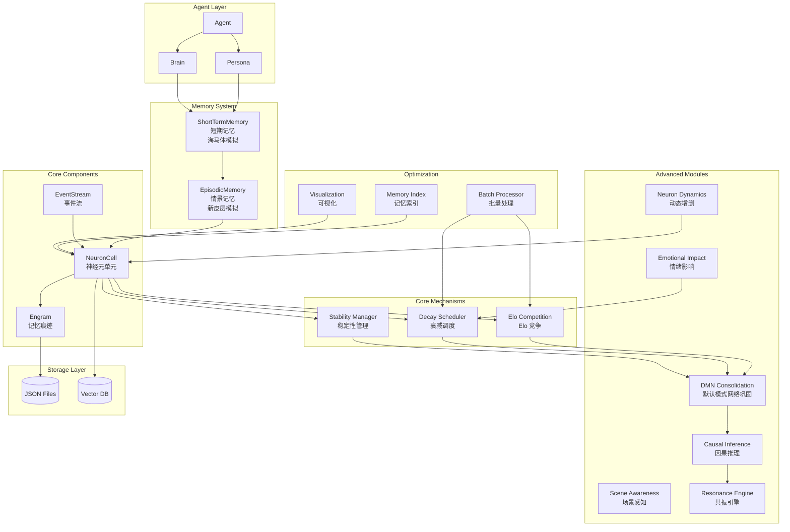
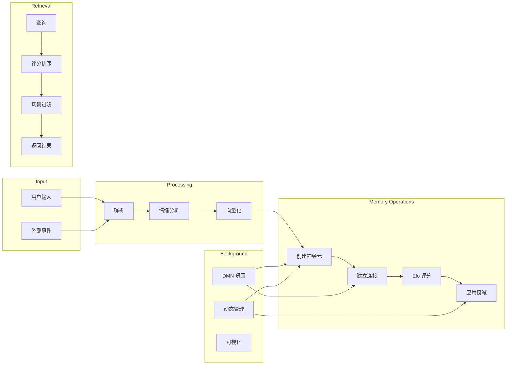

# Engram 记忆系统架构设计

**版本**: 1.0.0  
**更新时间**: 2026-04-14

---

## 一、整体架构图



---

## 二、各模块职责

### 2.1 核心组件

#### NeuronCell（神经元单元）

| 字段 | 类型 | 说明 |
|------|------|------|
| `event_id` | UUID1 | 唯一标识 |
| `event_type` | str | 事件类型：chat/perception/thought/reflection/experience |
| `strength` | float | 强度值，初始 1.0 |
| `decay_rate` | float | 衰减率，范围 0.98~0.9999 |
| `impact_score` | float | 冲击力评分 [0, 1] |
| `activation_threshold` | float | 激活阈值，默认 0.3 |
| `is_consolidated` | bool | 是否为稳固记忆 |
| `emotional_*` | float | 情绪三维度 |
| `outgoing_connections` | Set | 出向连接 |
| `incoming_connections` | Set | 入向连接 |

**核心方法**：
- `connect_to(other)` - 创建连接
- `apply_decay()` - 应用衰减
- `boost_strength()` - 增强强度
- `is_retrievable()` - 检查可检索性

#### Engram（记忆痕迹）

```python
class Engram(BaseModel):
    engram: Dict[str, List[NeuronCell]]  # 按类型组织
    represent: UUID1                      # 代表神经元
    strength: float                       # 整体强度
    summary: str                          # LLM 摘要
    scope: Literal["full", "partial"]    # 加载范围
```

**核心方法**：
- `add_event()` - 添加事件
- `add_neurons()` - 添加神经元
- `remove_neuron()` - 移除神经元
- `recall()` - 时间回溯
- `retain_relevant_neurons()` - 保留相关神经元

#### EventStream（事件流）

```python
class EventStream(BaseModel):
    log: Dict[UUID1, Events]  # 事件日志
```

**支持的事件类型**：
- `ChatEvent` - 对话事件
- `PerceptionEvent` - 感知事件
- `ThoughtEvent` - 思考事件
- `ReflectionEvent` - 反思事件
- `ExperienceEvent` - 经验事件

---

### 2.2 核心机制

#### Elo Competition（Elo 竞争）

**目的**：模拟神经元之间的资源竞争，高激活频率的神经元获得更高评分。

**核心算法**：
```python
def expected_win_probability(player_elo, opponent_elo):
    return 1 / (1 + 10^((opponent_elo - player_elo) / 400))

def calculate_combat_score(neuron_elo, activation_count):
    return sqrt(neuron_elo) * log(activation_count + 1)
```

**配置**：
```python
class EloConfig:
    initial_elo: float = 1000.0
    min_elo: float = 100.0
    max_elo: float = 2000.0
    default_k_factor: int = 32
```

#### Decay Scheduler（衰减调度器）

**目的**：实现"重要记忆长期保留，不重要记忆逐渐遗忘"。

**基础衰减率**：
| 事件类型 | 衰减率 |
|---------|--------|
| chat | 0.995 |
| perception | 0.990 |
| thought | 0.992 |
| reflection | 0.998 |
| experience | 0.985 |

**衰减公式**：
```
new_strength = old_strength * decay_rate^time_days
```

**情绪集成（Sprint 7）**：
```
impact_score = arousal * (1 - |valence|)
decay_rate = base_rate + impact_score * factor * (1 - base_rate)
```

#### Stability Manager（稳定性管理）

**目的**：集体稳定性机制，确保记忆碎片中任何成员都可能成为激活入口。

**聚合方法**：
- arithmetic（算术平均）
- harmonic（调和平均）
- geometric（几何平均）
- max（最大值）
- min（最小值）

```python
def calculate_engram_stability(neurons, method='arithmetic'):
    strengths = [n.strength for n in neurons]
    if method == 'arithmetic':
        return sum(strengths) / len(strengths)
    elif method == 'harmonic':
        return len(strengths) / sum(1/s for s in strengths)
```

---

### 2.3 高级模块

#### DMN Consolidation（DMN 巩固）

**默认模式网络 (DMN)**：
- 大脑空闲时的默认活动网络
- 功能：自我参照、情景记忆、思维漫游

**Engram 中的实现**：
```python
class DMNMode:
    def consolidate()      # 记忆巩固
    def prune()            # 弱连接修剪
    def associate()        # 关联建立
```

#### Causal Inference（因果推理）

**目的**：学习"什么导致什么"，超越简单的共现关系。

```python
class CausalInference:
    def learn_sequence()      # 学习激活序列
    def predict()              # 预测激活
    def get_related()          # 获取相关神经元
```

#### Scene Awareness（场景感知）

**目的**：根据当前场景上下文调整检索权重。

```python
class SceneContext:
    location: str       # 地点
    time: str           # 时间
    activity: str       # 活动
```

#### Resonance Engine（共振引擎）

**目的**：检测"共振"现象——多个相关记忆同时被激活。

```python
class ResonanceEngine:
    def detect_resonance()     # 检测共振
    def amplify()              # 增强共振
```

#### Emotional Impact（情绪影响）

**VAD 模型**：
- Valence（效价）：正面 vs 负面
- Arousal（唤醒度）：平静 vs 激动
- Dominance（主导性）：被动 vs 主动

```python
class EmotionalImpact:
    valence: float      # [-1, 1]
    arousal: float     # [0, 1]
    dominance: float   # [0, 1]
    
    def to_impact_score() -> float
    def to_decay_rate() -> float
```

#### Neuron Dynamics（动态增删）

**出生机制**：
- `CONTEXTUAL_IMPLICATION` - 上下文暗示
- `USER_REVELATION` - 用户揭示
- `PATTERN_EMERGENCE` - 模式涌现
- `REFLECTION_SYNTHESIS` - 反思综合
- `NEW_INTEREST` - 新兴趣

**死亡机制**：
- `STRENGTH_BELOW_THRESHOLD` - 强度低于阈值
- `INACTIVITY_TIMEOUT` - 长期不活跃
- `SELF_REFERENCE_LOOP` - 自我引用循环
- `INTEGRATED_AWAY` - 已整合

---

### 2.4 优化模块

#### Memory Index（记忆索引）

```python
class MemoryIndex:
    vector_index: Dict     # 向量索引
    time_index: Dict       # 时间索引
    tag_index: Dict        # 标签索引
    strength_index: Dict  # 强度索引
```

#### Batch Processor（批量处理）

```python
class BatchProcessor:
    def batch_activate()      # 批量激活
    def batch_decay()         # 批量衰减
    def batch_retrieve()      # 批量检索
```

#### Visualization（可视化）

```python
class NetworkVisualizer:
    def visualize_engram()    # 可视化单个 Engram
    def visualize_system()    # 可视化整个系统
```

---

## 三、数据流向



---

## 四、设计决策记录

### 4.1 核心决策

| 决策 | 原因 | 影响 |
|------|------|------|
| **Elo 替代简单计数器** | 防止热门记忆无限增长 | 更平衡的资源分配 |
| **动态衰减率** | 不同记忆价值不同 | "差点被撞"慢衰减，"每天遛狗"快衰减 |
| **集体稳定性** | 单个神经元可能丢失 | 任何成员都能激活记忆 |
| **碎片化存储** | 模拟神经网络的分布式存储 | 更灵活的检索和关联 |
| **双向连接** | 模拟真实突触 | 支持正向和反向激活 |

### 4.2 技术决策

| 决策 | 备选方案 | 选择理由 |
|------|----------|----------|
| **JSON 存储** | PostgreSQL/MongoDB | 简单、开发快 |
| **Pydantic 模型** | dataclass/attrs | 验证严格、易序列化 |
| **全局调度器** | 实例化调度 | 简化 API |

### 4.3 已知限制

1. **检索精度**：当前使用简单的关键词匹配，需要 embedding 集成
2. **并发支持**：单线程设计，多用户场景需加锁
3. **存储扩展**：JSON 文件不适合大规模数据
4. **因果推理**：当前为简化实现，准确性有限

---

## 五、关键概念解释

### 5.1 记忆是塑形，不是存储

传统数据库：写入 → 存储 → 读取  
Engram 思维：激活 → 重塑 → 输出

每次激活都会改变神经元状态，记忆不是静态存储的。

### 5.2 遗忘是不可达

遗忘 ≠ 删除。记忆还在，但触发条件变苛刻：
- 入口变少（连接衰减）
- 阈值变高（强度衰减）

特定线索可以瞬间激活（"顿悟"现象）。

### 5.3 检索是推理的一部分

检索不是独立的前置步骤，而是思考过程的延伸：
- 联想驱动
- 上下文感知
- 动态调整

---

## 六、演进路线

| Sprint | 功能 |
|--------|------|
| Sprint 1 | Elo 竞争 + 动态衰减 + 统一检索 |
| Sprint 2 | 记忆稳定性机制 |
| Sprint 3 | Reflection 自动化 |
| Sprint 4 | 存储优化 |
| Sprint 5 | DMN 巩固 + 场景感知 |
| Sprint 6 | 因果推理 + 共振引擎 |
| Sprint 7 | 情绪影响集成 |
| Sprint 8 | 神经元动态增删 |
| Sprint 9 | 可视化与调试 |
| Sprint 10 | 性能优化 |
