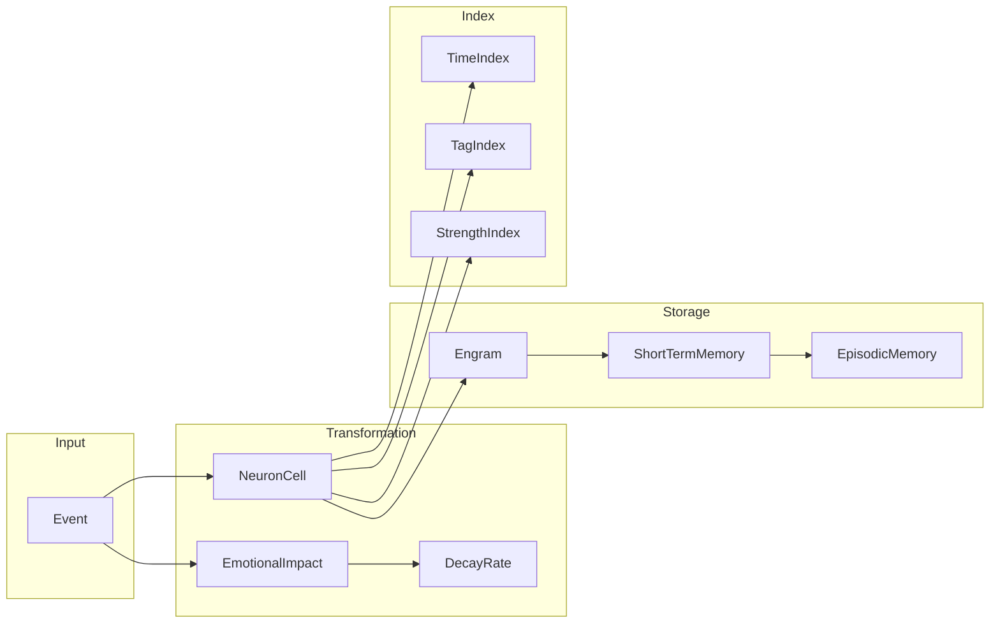

# Engram 数据模型文档

**版本**: 1.0.0  
**更新时间**: 2026-04-14

---

## 一、核心数据结构

### 1.1 NeuronCell（神经元单元）

神经元是记忆系统的基本单元，模拟生物神经元的激活-抑制机制。

```python
class NeuronCell(BaseModel):
    # === 标识字段 ===
    event_id: UUID1             # 唯一标识符（时间序 UUID）
    event_type: str             # 事件类型
    
    # === 时间字段 ===
    create_time: DateTime       # 创建时间
    last_decay_at: Optional[DateTime] = None  # 上次衰减时间
    
    # === 强度与衰减 (Sprint 1) ===
    strength: float = 1.0       # 强度值（Elo 评分）
    decay_rate: float = 0.995  # 衰减率（每日）
    impact_score: float = 0.5  # 冲击力评分 [0, 1]
    
    # === 激活与稳固 (Sprint 2) ===
    activation_threshold: float = 0.3  # 激活阈值
    is_consolidated: bool = False      # 是否为稳固记忆
    
    # === 情绪字段 (Sprint 7) ===
    emotional_valence: float = 0.0    # 效价 [-1, 1]
    emotional_arousal: float = 0.5   # 唤醒度 [0, 1]
    emotional_dominance: float = 0.5 # 主导性 [0, 1]
    
    # === 连接字段 ===
    outgoing_connections: Set[Connection]  # 出向连接
    incoming_connections: Set[Connection]   # 入向连接
    
    # === 参与者 ===
    actor: str                  # 行动者
    audience: Optional[List[str]] = None  # 受众
```

#### 字段详细说明

| 字段 | 类型 | 默认值 | 取值范围 | 说明 |
|------|------|--------|----------|------|
| `event_id` | UUID1 | uuid.uuid1() | - | 时间序唯一标识 |
| `event_type` | str | - | 5种类型 | 事件类型 |
| `strength` | float | 1.0 | [0, ∞) | 强度值，Elo 评分 |
| `decay_rate` | float | 0.995 | [0.98, 0.9999] | 每日衰减率 |
| `impact_score` | float | 0.5 | [0, 1] | 冲击力评分 |
| `activation_threshold` | float | 0.3 | [0, 1] | 激活阈值 |
| `is_consolidated` | bool | False | - | 是否稳固 |
| `emotional_valence` | float | 0.0 | [-1, 1] | 情绪效价 |
| `emotional_arousal` | float | 0.5 | [0, 1] | 情绪唤醒度 |
| `emotional_dominance` | float | 0.5 | [0, 1] | 情绪主导性 |

#### Connection 子结构

```python
class Connection(BaseModel):
    target_id: UUID1       # 目标神经元 ID
    create_time: DateTime  # 连接创建时间
```

---

### 1.2 Engram（记忆痕迹）

Engram 是一组神经元的集合，代表一个完整的记忆片段。

```python
class Engram(BaseModel):
    # === 神经元存储 ===
    engram: Dict[str, List[NeuronCell]] = {
        'chat': [],
        'thought': [],
        'reflection': [],
        'perception': [],
        'experience': [],
    }
    
    # === 标识与摘要 ===
    uuid: UUID1 = Field(default_factory=uuid.uuid1)  # Engram 唯一 ID
    represent: UUID1 = Field(default_factory=uuid.uuid1)  # 代表神经元 ID
    summary: str = ""  # LLM 生成的摘要
    
    # === 状态字段 ===
    strength: float = 1.0  # 整体强度
    scope: Literal["full", "partial"] = "partial"  # 加载范围
    time: DateTime  # 创建时间
    
    # === 参与者 ===
    actor: List[str]                    # 行动者列表
    audience: Optional[List[str]] = None  # 受众列表
```

#### 字段详细说明

| 字段 | 类型 | 默认值 | 说明 |
|------|------|--------|------|
| `engram` | Dict | 5类空列表 | 按类型组织的神经元 |
| `uuid` | UUID1 | uuid.uuid1() | Engram 唯一标识 |
| `represent` | UUID1 | uuid.uuid1() | 代表神经元 ID |
| `summary` | str | "" | LLM 生成的摘要 |
| `strength` | float | 1.0 | 整体强度（成员聚合） |
| `scope` | str | "partial" | "full"=完整加载, "partial"=部分加载 |
| `time` | DateTime | - | 创建时间 |
| `actor` | List[str] | - | 行动者列表 |
| `audience` | List[str] | None | 受众列表 |

---

### 1.3 Event（事件）

事件是输入系统的基本数据单位，会转换为神经元存储。

```python
# 基础事件
class BaseEvent(BaseModel):
    event_type: str
    actor: str
    audience: Optional[List[str]] = None
    content: str
    location: Optional[str] = None
    event_id: UUID1 = Field(default_factory=uuid.uuid1)
    create_time: DateTime

# 对话事件
class ChatEvent(BaseEvent):
    event_type: Literal["chat"] = "chat"

# 感知事件
class PerceptionEvent(BaseEvent):
    event_type: Literal["perception"] = "perception"

# 思考事件
class ThoughtEvent(BaseEvent):
    event_type: Literal["thought"] = "thought"

# 反思事件
class ReflectionEvent(BaseEvent):
    event_type: Literal["reflection"] = "reflection"

# 经验事件
class ExperienceEvent(BaseEvent):
    event_type: Literal["experience"] = "experience"
    duration: Optional[int] = None  # 持续时间（分钟）
    end_time: Optional[DateTime] = None  # 结束时间
```

#### 事件类型说明

| 类型 | 说明 | 典型衰减率 |
|------|------|-----------|
| `chat` | 对话消息 | 0.995 |
| `perception` | 感知输入 | 0.990 |
| `thought` | 内部思考 | 0.992 |
| `reflection` | 反思总结 | 0.998 |
| `experience` | 经验事件 | 0.985 |

---

## 二、配置数据结构

### 2.1 EloConfig

```python
class EloConfig(BaseModel):
    initial_elo: float = 1000.0     # 初始 Elo 值
    min_elo: float = 100.0         # 最小 Elo 值
    max_elo: float = 2000.0        # 最大 Elo 值
    default_k_factor: int = 32     # 默认 K 因子
```

### 2.2 DecayConfig

```python
class DecayConfig(BaseModel):
    decay_rate_range: Tuple[float, float] = (0.98, 0.9999)
    
    base_decay_rates: Dict[str, float] = {
        "chat": 0.995,
        "perception": 0.990,
        "thought": 0.992,
        "reflection": 0.998,
        "experience": 0.985,
    }
    
    impact_decay_factor: float = 0.5  # 冲击力影响因子
```

### 2.3 StabilityConfig

```python
class StabilityConfig(BaseModel):
    default_method: str = "arithmetic"  # 聚合方法
    threshold: float = 0.3              # 激活阈值
    consolidation_bonus: float = 1.5    # 巩固加成
```

---

## 三、状态数据结构

### 3.1 NeuronEloState

```python
class NeuronEloState(BaseModel):
    neuron_id: str
    elo: float
    activation_count: int = 0
    win_count: int = 0
    last_activation: Optional[DateTime] = None
    
    def get_k_factor(config: EloConfig) -> float:
        """动态 K-factor：
        - 高频 (>50): K=16
        - 中频 (10-50): K=32
        - 低频 (<10): K=64
        """
```

### 3.2 NeuronDecayState

```python
class NeuronDecayState(BaseModel):
    neuron_id: str
    strength: float
    decay_rate: float
    last_decay: Optional[DateTime] = None
```

### 3.3 RegistryMetadata

```python
class RegistryMetadata(BaseModel):
    time: DateTime              # Engram 创建时间
    summary: str                # Engram 摘要
    strength: float             # Engram 强度
    actor: List[str]            # 行动者
    audience: Optional[List[str]] = None  # 受众
    scope: Literal['full', 'partial'] = 'partial'  # 加载范围
```

---

## 四、情绪与影响模型

### 4.1 EmotionalImpact

```python
class EmotionalImpact(BaseModel):
    """VAD 情绪模型"""
    valence: float = 0.0        # [-1, 1] 正面 ~ 负面
    arousal: float = 0.5        # [0, 1] 平静 ~ 激动
    dominance: float = 0.5     # [0, 1] 被动 ~ 主动
    
    def to_impact_score(self) -> float:
        """转换为冲击力评分
        
        公式: impact = arousal * (1 - |valence|) + |valence| * 0.2
        """
        emotional_intensity = self.arousal * (1.0 - abs(self.valence))
        valence_boost = abs(self.valence) * 0.2
        return min(1.0, emotional_intensity + valence_boost)
    
    def to_decay_rate(self, base_rate: float = 0.995) -> float:
        """转换为衰减率
        
        高冲击 -> 慢衰减
        """
        impact = self.to_impact_score()
        return base_rate + impact * 0.5 * (1 - base_rate)
```

### 4.2 ImpactMapper

```python
class ImpactMapper:
    """情绪到冲击力的映射器"""
    
    def map_emotion_to_decay(
        self,
        emotion: EmotionalImpact,
        base_decay: float = 0.995
    ) -> float:
        """从情绪计算衰减率"""
        impact = emotion.to_impact_score()
        return base_decay + impact * 0.5 * (1 - base_decay)
    
    def map_emotion_to_strength_boost(
        self,
        emotion: EmotionalImpact
    ) -> float:
        """从情绪计算初始强度加成"""
        return 1.0 + emotion.to_impact_score() * 0.5
```

---

## 五、场景上下文

### 5.1 SceneContext

```python
class SceneContext(BaseModel):
    """场景上下文"""
    location: Optional[str] = None  # 地点
    time: Optional[str] = None      # 时间 (morning/afternoon/evening/night)
    activity: Optional[str] = None  # 活动
    participants: Optional[List[str]] = None  # 参与者
    mood: Optional[str] = None     # 氛围
    
    def matches(self, other: 'SceneContext') -> float:
        """计算两个场景的匹配度 [0, 1]"""
```

---

## 六、动态管理数据

### 6.1 BirthCriteria

```python
class BirthCriteria(BaseModel):
    """神经元出生条件"""
    min_context_support: float = 0.5   # 最小上下文支持
    min_activation_threshold: float = 0.3  # 最小激活阈值
    
    reasons: List[BirthReason] = Field(default_factory=lambda: [
        BirthReason.CONTEXTUAL_IMPLICATION,
        BirthReason.USER_REVELATION,
        BirthReason.PATTERN_EMERGENCE,
        BirthReason.REFLECTION_SYNTHESIS,
        BirthReason.NEW_INTEREST,
    ])
```

### 6.2 DeathCriteria

```python
class DeathCriteria(BaseModel):
    """神经元死亡条件"""
    strength_threshold: float = 0.05     # 强度阈值
    inactivity_days: int = 90            # 不活跃天数
    max_self_reference_depth: int = 5   # 最大自我引用深度
    
    reasons: List[DeathReason] = Field(default_factory=lambda: [
        DeathReason.STRENGTH_BELOW_THRESHOLD,
        DeathReason.INACTIVITY_TIMEOUT,
        DeathReason.SELF_REFERENCE_LOOP,
        DeathReason.INTEGRATED_AWAY,
    ])
```

### 6.3 BirthReason / DeathReason 枚举

```python
class BirthReason(str, Enum):
    """神经元出生原因"""
    CONTEXTUAL_IMPLICATION = "contextual_implication"    # 上下文暗示
    USER_REVELATION = "user_revelation"                  # 用户揭示
    PATTERN_EMERGENCE = "pattern_emergence"              # 模式涌现
    REFLECTION_SYNTHESIS = "reflection_synthesis"        # 反思综合
    NEW_INTEREST = "new_interest"                        # 新兴趣

class DeathReason(str, Enum):
    """神经元死亡原因"""
    STRENGTH_BELOW_THRESHOLD = "strength_below_threshold"  # 强度低于阈值
    INACTIVITY_TIMEOUT = "inactivity_timeout"              # 长期不活跃
    SELF_REFERENCE_LOOP = "self_reference_loop"           # 自我引用循环
    INTEGRATED_AWAY = "integrated_away"                   # 已整合
```

---

## 七、内存管理数据结构

### 7.1 ShortTermMemory

```python
class ShortTermMemory(BaseModel):
    """短期记忆（海马体模拟）"""
    sequences: Dict[str, Engram] = {}  # 按受众组织的 Engram
```

### 7.2 EpisodicMemory

```python
class EpisodicMemory(BaseModel):
    """情景记忆（新皮层模拟）"""
    registry: Dict[str, Dict[UUID1, RegistryMetadata]] = {}  # 按受众的元数据
    engram_managers: Dict[str, EngramManager] = {}           # 按受众的管理器
```

---

## 八、索引数据结构

### 8.1 MemoryIndex

```python
class MemoryIndex:
    """记忆索引"""
    vector_index: Dict[str, List[float]] = {}    # 向量索引
    time_index: Dict[str, Dict[str, Set[str]]] = {}  # 时间索引
    tag_index: Dict[str, Set[str]] = {}          # 标签索引
    strength_index: Dict[str, float] = {}       # 强度索引
```

---

## 九、数据流向图



---

## 十、字段约束汇总

| 字段 | 最小值 | 最大值 | 特殊约束 |
|------|--------|--------|----------|
| `strength` | 0 | ∞ | - |
| `decay_rate` | 0.98 | 0.9999 | - |
| `impact_score` | 0 | 1 | - |
| `activation_threshold` | 0 | 1 | - |
| `emotional_valence` | -1 | 1 | - |
| `emotional_arousal` | 0 | 1 | - |
| `emotional_dominance` | 0 | 1 | - |
| `elo` | 100 | 2000 | min_elo ~ max_elo |
| `k_factor` | 1 | 64 | - |
